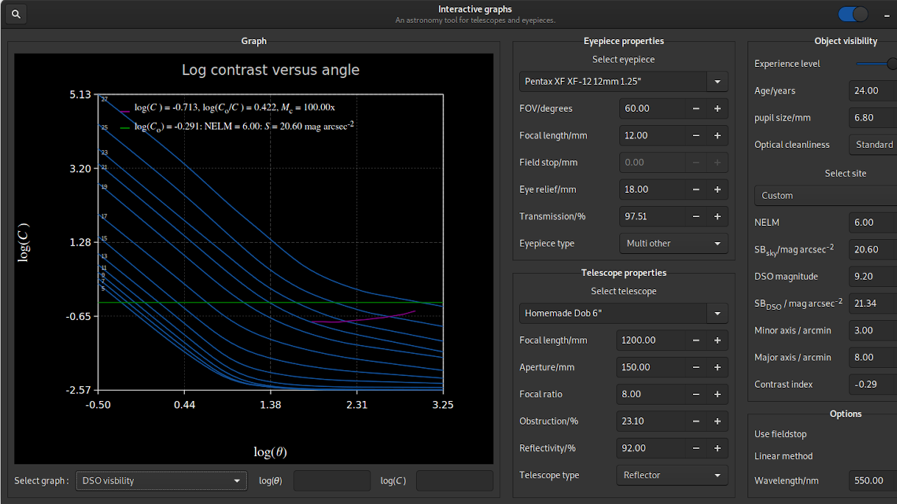

GNOME TCalc - An astronomy tool for telescopes and eyepieces (written in gtkmm and C++) for the linux desktop. The software is intended as a learning tool for amateur astronomers, with an interest in visual astronomy.\
Help Documentation is included.\

Clone the Tcalc repo, at the comand prompt - 

$git clone https://github.com/AlexB67/TCalc.git

From the command line.

$cd TCalc\
$mkdir build\
$meson build/\
$cd build\
$ninja\
$sudo ninja install

To uninstall

$sudo ninja uninstall

If you have used the software before please delete your user eyepiecesuser.TCalc and telescopesuser.TCalc files, \ 
if they exist. Found in /home/your_username/.config/gnome-tcalc

This will add the application to /user/local and appear in the applications list as GNOME TCalc.

Note: this is a vscode project but works equally well in gnome-builder, just point builder to the TCalc folder and open it.

Neither are required to build or install the project. To be build as an rpm package in future. 

The following packages are required to build the software natively.
git\
gettext\
appstream-util\
gtkmm development libraries\
meson\
ninja build system\

Consult/search your distribution for the above packages and install them if required. Flatpak builds will download the relevant packages automatically.

