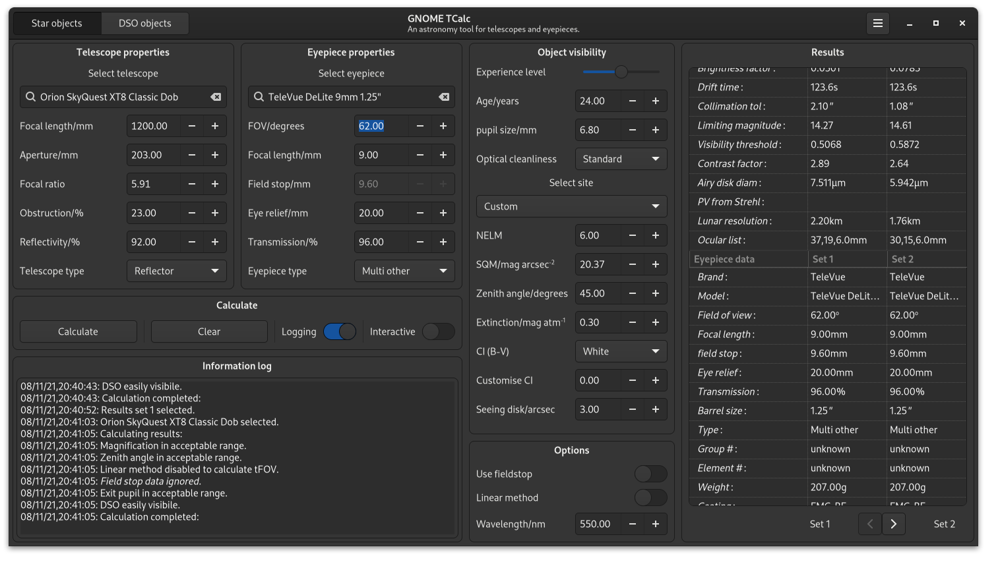

### GNOME TCalc - An astronomy tool for telescopes and eyepieces 

Written in gtkmm4 and C++ for the linux desktop. The software is intended as a learning tool for amateur astronomers, with an interest in visual astronomy. TCalc offers a number of computations, a graphical view, and an ocular viewer. Help Documentation is included.



### Buiilding the software
Clone the Tcalc repo, at the comand prompt - 

```
$git clone https://github.com/AlexB67/TCalc.git
$cd TCalc
$mkdir build
$meson build/
$cd build
$ninja
$sudo ninja install
```

To uninstall

```
$sudo ninja uninstall
```

If you have used the software before please delete your user eyepiecesuser.TCalc and telescopesuser.TCalc files, if they exist. Found in /home/your_username/.config/gnome-tcalc

This will add the application to /user/local and appear in the applications list as GNOME TCalc. To be build as an rpm package in future. 

The following packages are required to build the software natively.
* git
* gettext
* appstream-util
* gtkmm 4.0.2 or greater development libraries
* meson
* ninja build system

Consult/search your distribution for the above packages and install them if required. in Fedora 35 it would typically involve
```
sudo dnf install gtkmm4-devel
sudo dnf appstream-util
sudo dnf gettext
```

If in doubt use dnf search to find them

```
dnf search gtkmm
dnf search appstream
```

etc. 

Some platforms may not yet have gtkmm4. You can still install the older tcalc-gtkmm3 version by using the tcalc-gtkmm3 branch
To switch to this branch simple do
```
git checkout tcalc-gtkmm3
```
Enjoy.